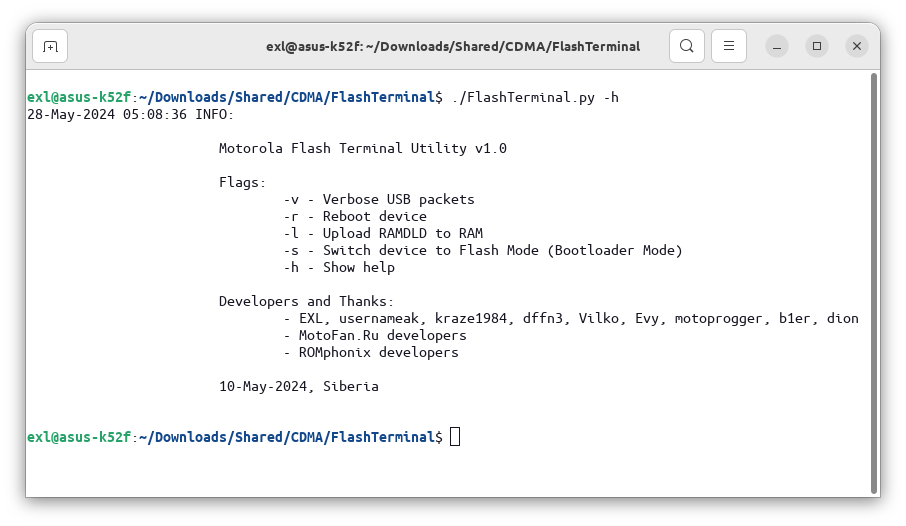

Flash Terminal
==============

A set of utilities and patched/hacked RAMDLD loaders (RAM downloaders) for dumping SRAM, NAND, NOR, etc. memory chips data of Motorola phones and researching the Motorola Flash Protocol.



## Dependencies

```bash
# pip install pyusb
# pip install pyserial

# Alternative non-pip Debian-like Linux distros.
$ sudo apt install python3-usb
$ sudo apt install python3-serial
```

## Usage

The workflow can be configured directly in the [FlashTerminal.py](FlashTerminal.py) file's `Settings` and `Worksheet` sections.

```bash
$ ./FlashTerminal.py -v # Activate verbose hexdump USB-packets logging.
$ ./FlashTerminal.py -r # Reboot device.
$ ./FlashTerminal.py -l # Upload RAMDLD to RAM.
$ ./FlashTerminal.py -s # Switch device to Flash Mode (Bootloader Mode)
$ ./FlashTerminal.py -h # Show help.
```

**Dumping 32 MB NOR Memory from Motorola TRIPLETS-like phones**

```python
mfp_upload_binary_to_addr(er, ew, 'loaders/E398_RAMLD_07B0_Hacked_Dump.ldr', 0x03FD0000, 0x03FD0010)
time.sleep(1.0)
mfp_dump_dump(er, ew, 'E398_ROM_Dump.bin', 0x10000000, 0x12000000, 0x100)
```

**Dumping 64 MB NOR Memory from Motorola RAZR V3x (+ IROM)**

```python
mfp_upload_binary_to_addr(er, ew, 'loaders/V3x_RAMDLD_0682_RSA_Read.ldr', 0x08000000, 0x08000010, True)
time.sleep(1.0)
mfp_dump_read(er, ew, 'V3x_ROM_Dump.bin', 0x10000000, 0x14000000, 0x100)
```

**Dumping 16 MB NOR Memory from Motorola A835, Motorola A845, and Siemens U15 (+ IROM)**

```python
mfp_upload_binary_to_addr(er, ew, 'loaders/A835_RAMDLD_0612_Hacked_RSA_Read.ldr', 0x08000000, 0x08018818)
time.sleep(1.0)
mfp_cmd(er, ew, 'RQHW')
mfp_binary_cmd(er, ew, b'\x00\x00\x05\x70', False)
mfp_upload_raw_binary(er, ew, 'loaders/A835_Additional_Payload_1.bin', None, False)
mfp_upload_raw_binary(er, ew, 'loaders/A835_Additional_Payload_2.bin')
mfp_binary_cmd(er, ew, b'\x53\x00\x00\x00\x00\x00\x00\xA0\x00')
mfp_binary_cmd(er, ew, b'\x41')
mfp_dump_r(er, ew, 'A835_ROM_Dump.bin', 0x10000000, 0x11000000, 0x100)
mfp_dump_r(er, ew, 'A835_IROM_Dump.bin', 0x00000000, 0x00006100, 0x100)
```

**Dumping 16 MB NOR Memory from Motorola A830 and Siemens U10 (+ IROM)**

```python
mfp_upload_binary_to_addr(er, ew, 'A830_RAMDLD_0520_Patched_Dump_NOR.ldr', 0x07800000, 0x07800010)
time.sleep(1.0)
mfp_dump_sram(er, ew, 'A830_IROM_Dump.bin', 0x00000000, 0x00010000, 0x30)
mfp_dump_sram(er, ew, 'U10_ROM_Dump.bin', 0x10000000, 0x11000000, 0x30)
```

**Dumping 64 MB NAND Memory from Motorola RAZR V3m, Motorola W755, Motorola E815, Motorola W385**

```python
mfp_upload_binary_to_addr(er, ew, 'loaders/V3m_RAMDLD_010C_Patched_Dump_NAND.ldr', 0x00100000, 0x00100000, True)
time.sleep(1.0)
mfp_dump_nand(er, ew, 'V3m_NAND_Dump.bin', 0, int(0x04000000 / 512), 0x10, 1, 0x64000000)
```

**Dumping 64 MB SRAM Memory from Motorola RAZR2 V9m and Motorola ROKR Z6m**

```python
mfp_upload_binary_to_addr(er, ew, 'V9m_RAMDLD_01B5_Patched_Dump_SRAM.ldr', 0x00100000, 0x00100000)
time.sleep(1.0)
mfp_dump_sram(er, ew, 'Z6m_SRAM_Dump.bin', 0x00000000, 0x04000000, 0x30)
mfp_dump_sram(er, ew, 'V9m_SRAM_Dump.bin', 0x00000000, 0x04000000, 0x30)
```

**Dumping 64 MB and 128 MB NAND Memory from Motorola RAZR2 V9m and Motorola ROKR Z6m**

```python
mfp_upload_binary_to_addr(er, ew, 'V9m_RAMDLD_01B5_Patched_Dump_NAND.ldr', 0x00100000, 0x00100000)
time.sleep(1.0)
mfp_dump_nand(er, ew, 'Z6m_NAND_Dump.bin', 0, int(0x04000000 / 512), 0x30)
mfp_dump_nand(er, ew, 'V9m_NAND_Dump.bin', 0, int(0x08000000 / 512), 0x30)
```

**Dumping 128 MB and 256 MB NAND Memory from Motorola VE40 and Motorola Hint QA30 (+ IROM)**

```python
mfp_upload_binary_to_addr(er, ew, 'QA30_RAMDLD_0206_Patched_Dump_SRAM.ldr', 0x002F0000, 0x002F0000)
time.sleep(1.0)
mfp_dump_sram(er, ew, 'MSM_IRAM_Dump.bin', 0xFFFF0000, 0xFFFFFFFF, 0x10)

mfp_upload_binary_to_addr(er, ew, 'QA30_RAMDLD_0206_Patched_Dump_NAND.ldr', 0x002F0000, 0x002F0000)
time.sleep(1.0)
mfp_dump_nand(er, ew, 'VE40_NAND_Dump.bin', 0, int(0x08000000 / 512), 0x10)

mfp_upload_binary_to_addr(er, ew, 'QA30_RAMDLD_0206_Patched_Dump_NAND_WIDE.ldr', 0x002F0000, 0x002F0000)
time.sleep(1.0)
mfp_dump_nand(er, ew, 'QA30_NAND_Dump.bin', 0, int(0x04000000 / 512), 0x10, 4)
```


## Developers & Thanks

- EXL, usernameak, kraze1984, dffn3, Vilko, Evy, motoprogger, b1er, dion
- MotoFan.Ru developers
- ROMphonix developers
- asdf, PUNK-398

## Useful Information and Resources

- https://github.com/dumpit3315/dumpit by dffn3
- MotoFan.Ru forum about modding Motorola phones
- ROMphonix Club Discord server
