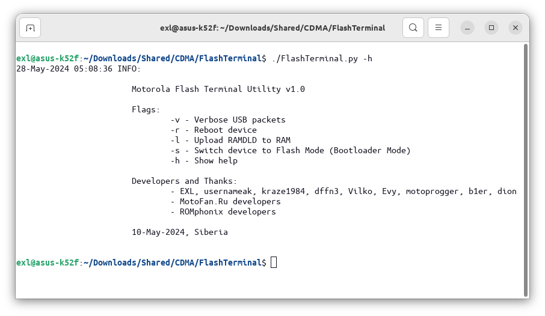

Flash Terminal
==============

A set of utilities and patched/hacked RAMDLD loaders (RAM downloaders) for dumping SRAM, NAND, NOR, etc. memory chips data of Motorola phones and researching the Motorola Flash Protocol.



Detailed user manual: [LPCwiki](https://lpcwiki.miraheze.org/wiki/Dumping_firmware_from_phones/Motorola#FlashTerminal)

## Dependencies

* Python 3.6+

```bash
# pip install pyusb
# pip install pyserial

# Alternative non-pip Debian-like Linux distros.
$ sudo apt install python3-usb
$ sudo apt install python3-serial
```

## Usage

The workflow can be configured directly in the [FlashTerminal.py](FlashTerminal.py) file's `Settings` and `Worksheet` sections.

```bash
$ ./FlashTerminal.py -v # Activate verbose hexdump USB-packets logging.
$ ./FlashTerminal.py -r # Reboot device.
$ ./FlashTerminal.py -l # Upload RAMDLD to RAM.
$ ./FlashTerminal.py -s # Switch device to Flash Mode (Bootloader Mode).
$ ./FlashTerminal.py -2 # Use second USB interface for BP Bootloader.
$ ./FlashTerminal.py -h # Show help.
```

## Dumping Table

These phones were dumped by the Flash Terminal tool.

| Phone        | SoC                   | Flash           | Loader                                        | Dumped by                |
|--------------|-----------------------|-----------------|-----------------------------------------------|--------------------------|
| A830         | Rainbow               | 16 MiB (NOR)    | A830_RAMDLD_0520_Patched_Dump_NOR.ldr         | EXL, greyowls            |
| U10          | Rainbow               | 16 MiB (NOR)    | A830_RAMDLD_0520_Patched_Dump_NOR.ldr         | EXL                      |
| A835         | Rainbow POG           | 16 MiB (NOR)    | A835_RAMDLD_0612_Hacked_RSA_Read.ldr          | PUNK-398                 |
| A845         | Rainbow POG           | 16 MiB (NOR)    | A835_RAMDLD_0612_Hacked_RSA_Read.ldr          | PUNK-398                 |
| C975         | Rainbow POG           | 32 MiB (NOR)    | A835_RAMDLD_0612_Hacked_RSA_Read.ldr          | diokhann, metalman87     |
| V980         | Rainbow POG           | 32 MiB (NOR)    | A835_RAMDLD_0612_Hacked_RSA_Read.ldr          | metalman87               |
| E1000        | Rainbow POG           | 64 MiB (NOR)    | A835_RAMDLD_0612_Hacked_RSA_Read.ldr          | PUNK-398                 |
| E398         | Neptune LTE           | 32 MiB (NOR)    | E398_RAMLD_07B0_Hacked_Dump.ldr               | EXL                      |
| V3x          | Rainbow POG           | 64 MiB (NOR)    | V3x_RAMDLD_0682_RSA_Read.ldr                  | EXL                      |
| A1000        | BP: Rainbow POG       | 16 MiB (NOR)    | A1000_BP_RAMDLD_0651_RSA_Read.ldr             | PUNK-398                 |
| C350L        | Neptune ULS           | 8 MiB (NOR)     | C350L_RAMDLD_0000_Patched_Dump_NOR.ldr        | EXL                      |
| C330         | Neptune LT (LCA)      | 8 MiB (NOR)     | E380_RAMDLD_0910_Hacked_Dump.ldr              | Ivan_Fox                 |
| C350         | Neptune LT (LCA)      | 8 MiB (NOR)     | E380_RAMDLD_0910_Hacked_Dump.ldr              | diokhann                 |
| C450         | Neptune LT (LCA)      | 16 MiB (NOR)    | E380_RAMDLD_0910_Hacked_Dump.ldr              | metalman87, ahsim2009    |
| C550         | Neptune LT (LCA)      | 16 MiB (NOR)    | E380_RAMDLD_0910_Hacked_Dump.ldr              | ahsim2009                |
| E380         | Neptune LT (LCA)      | 16 MiB (NOR)    | E380_RAMDLD_0910_Hacked_Dump.ldr              | SGXVII                   |
| V60          | Patriot               | 4 MiB (NOR)     | V60_RAMDLD_0355_Patched_Dump_NOR.ldr          | Ivan_Fox                 |
| V66i         | Patriot               | 8 MiB (NOR)     | V60_RAMDLD_0355_Patched_Dump_NOR.ldr          | Ivan_Fox                 |
| V60i         | Patriot               | 8 MiB (NOR)     | V60i_RAMDLD_1007_Patched_Dump_NOR.ldr         | metalman87               |
| V70          | Patriot               | 8 MiB (NOR)     | V60_RAMDLD_0355_Patched_Dump_NOR.ldr          | kostett                  |
| T720i        | Patriot               | 8 MiB (NOR)     | T720_RAMDLD_0370_Patched_Dump_NOR.ldr         | diokhann                 |
| V120c        | Wally                 | 4 MiB (NOR)     | V120c_RAMDLD_0312_Patched_Dump_NOR.ldr        | NextG50                  |
| ic902        | MSM6800               | 128 MiB (NAND)  | QA30_RAMDLD_0206_Patched_Dump_NAND.ldr        | EXL                      |
| QA30         | MSM6575               | 256 MiB (NAND)  | QA30_RAMDLD_0206_Patched_Dump_NAND_WIDE.ldr   | EXL                      |
| V9m          | MSM6550               | 128 MiB (NAND)  | V9m_RAMDLD_01B5_Patched_Dump_NAND.ldr         | EXL                      |
| VE40         | MSM6800               | 128 MiB (NAND)  | QA30_RAMDLD_0206_Patched_Dump_NAND.ldr        | EXL                      |
| Z6m          | MSM6550               | 64 MiB (NAND)   | V9m_RAMDLD_01B5_Patched_Dump_NAND.ldr         | EXL                      |
| V3m          | MSM6500               | 64 MiB (NAND)   | V3m_RAMDLD_010C_Patched_Dump_NAND.ldr         | asdf                     |
| W755         | MSM6500               | 64 MiB (NAND)   | V3m_RAMDLD_010C_Patched_Dump_NAND.ldr         | asdf                     |
| E815         | MSM6500               | 64 MiB (NAND)   | V3m_RAMDLD_010C_Patched_Dump_NAND.ldr         | asdf                     |
| W385         | MSM6125               | 64 MiB (NAND)   | V3m_RAMDLD_010C_Patched_Dump_NAND.ldr         | asdf, wavvy01            |
| V325i        | MSM6100               | 64 MiB (NAND)   | V325i_RAMDLD_010A_Patched_Dump_NAND.ldr       | asdf                     |
| V325xi       | MSM6100               | 64 MiB (NAND)   | V325i_RAMDLD_010A_Patched_Dump_NAND.ldr       | asdf                     |
| K1m (K1mm)   | MSM6500               | 64 MiB (NAND)   | K1mm_RAMDLD_000D_Patched_Dump_NAND.ldr        | wavvy01                  |
| V120e        | MSM5100               | 4+1 MiB (NOR)   | V120e_RAMDLD_0713_Patched_Dump_NOR.ldr        | metalman87               |
| W315         | MSM6050               | 16 MiB (NOR)    | W315_RAMDLD_0106_Patched_Dump_NOR.ldr         | asdf                     |
| A760         | AP: Dalhart           | 32 MiB (NOR)    | A760_AP_RAMDLD_0000_Patched_Dump_NOR.ldr      | EXL, PUNK-398            |
| A760         | BP: Neptune LT (LCA)  | 4 MiB (NOR)     | A760_BP_RAMDLD_0372_Patched_Dump_NOR.ldr      | EXL, PUNK-398            |
| A768i        | AP: Dalhart           | 32 MiB (NOR)    | A768i_AP_RAMDLD_0000_Patched_Dump_NOR.ldr     | EXL                      |
| A768i        | BP: Neptune LTE       | 4 MiB (NOR)     | A768i_BP_RAMDLD_0731_Patched_Dump_NOR.ldr     | EXL                      |
| A780DVB-H    | BP: Neptune LTE       | 4 MiB (NOR)     | A780g_BP_RAMDLD_08A0.ldr                      | ronalp                   |

## Dumping Worksheet Parameters

**Dumping 32 MB NOR Memory from Motorola TRIPLETS-like phones**

```python
mfp_upload_binary_to_addr(er, ew, 'loaders/E398_RAMLD_07B0_Hacked_Dump.ldr', 0x03FD0000, 0x03FD0010)
mfp_dump_dump(er, ew, 'E398_ROM_Dump.bin', 0x10000000, 0x12000000, 0x100)
```

**Dumping 64 MB NOR Memory from Motorola RAZR V3x**

```python
mfp_upload_binary_to_addr(er, ew, 'loaders/V3x_RAMDLD_0682_RSA_Read.ldr', 0x08000000, 0x08000010, True)
mfp_dump_read(er, ew, 'V3x_ROM_Dump.bin', 0x10000000, 0x14000000, 0x100)
```

**Dumping BP 16 MB NOR Memory from Motorola A1000**

```python
# ./FlashTerminal.py -l
mfp_upload_binary_to_addr(er, ew, 'loaders/A1000_BP_RAMDLD_0651_RSA_Read.ldr', 0x08000000, 0x08000010, True)
mfp_dump_read(er, ew, 'A1000_ROM_Dump.bin', 0x10000000, 0x11000000, 0x100)

# ./FlashTerminal.py
mfp_upload_binary_to_addr(er, ew, 'loaders/A1000_BP_RAMDLD_0651_RSA_Read.ldr', 0x08000000, 0x08000010, True)
mfp_dump_rqrc(er, ew, 'A1000_PDS_ROM_Dump.bin', 0x10010000, 0x10020000)
```

**Dumping 16 MB NOR Memory from Motorola A835, A845, C975, E1000 and Siemens U15 (+ IROM)**

```python
mfp_upload_binary_to_addr(er, ew, 'loaders/A835_RAMDLD_0612_Hacked_RSA_Read.ldr', 0x08000000, 0x08018818)
#	mfp_cmd(er, ew, 'RQVN')
mfp_cmd(er, ew, 'RQHW')
mfp_binary_cmd(er, ew, b'\x00\x00\x05\x70', False)
mfp_upload_raw_binary(er, ew, 'loaders/A835_Additional_Payload_1.bin', None, False)
mfp_upload_raw_binary(er, ew, 'loaders/A835_Additional_Payload_2.bin')
mfp_binary_cmd(er, ew, b'\x53\x00\x00\x00\x00\x00\x00\xA0\x00')
mfp_binary_cmd(er, ew, b'\x41')
mfp_dump_r(er, ew, 'A835_ROM_Dump.bin', 0x10000000, 0x11000000, 0x100)
mfp_dump_r(er, ew, 'A835_IROM_Dump.bin', 0x00000000, 0x00006100, 0x100)

mfp_dump_r(er, ew, 'C975_ROM_Dump.bin', 0x10000000, 0x12000000, 0x100)
mfp_dump_r(er, ew, 'E1000_ROM_Dump.bin', 0x10000000, 0x14000000, 0x100)
```

**Dumping 16 MB NOR Memory from Motorola A830 and Siemens U10 (+ IROM)**

```python
mfp_upload_binary_to_addr(er, ew, 'A830_RAMDLD_0520_Patched_Dump_NOR.ldr', 0x07800000, 0x07800010)
mfp_dump_sram(er, ew, 'U10_ROM_Dump.bin', 0x10000000, 0x11000000, 0x30)
mfp_dump_sram(er, ew, 'A830_IROM_Dump.bin', 0x00000000, 0x00010000, 0x30)
```

**Dumping 8 MB NOR Memory from Motorola C350L (+ IROM)**

```python
#	mfp_cmd(er, ew, 'RQHW')
#	mfp_cmd(er, ew, 'RQVN')
mfp_uls_upload(er, ew, 'loaders/C350L_RAMDLD_0000_Patched_Dump_NOR.ldr', 0x12000000, 0x1000, False)
mfp_dump_sram(er, ew, 'C350L_ROM_Dump.bin', 0x10000000, 0x10800000, 0x30)
mfp_dump_sram(er, ew, 'C350L_IROM_Dump.bin', 0x00000000, 0x00040000, 0x30)
```

**Dumping 8 MB and 16 MB NOR Memory from Motorola C330, C350, C450, C550, E380 (+ IROM)**

```python
mfp_upload_binary_to_addr(er, ew, 'loaders/E380_RAMDLD_0910_Hacked_Dump.ldr', 0x01FD0000, 0x01FD0010)
mfp_dump_dump(er, ew, 'C350_ROM_Dump.bin', 0x00000000, 0x00800000, 0x100)
mfp_dump_dump(er, ew, 'C350_IROM_Dump.bin', 0x10000000, 0x10400000, 0x100)
mfp_dump_dump(er, ew, 'C550_ROM_Dump.bin', 0x00000000, 0x01000000, 0x100)
```

**Dumping 4 MB and 8 MB NOR Memory from Motorola V60/V60i, Motorola V66/V66i, Motorola V70 (+ IROM)**

```python
mfp_upload_binary_to_addr(er, ew, 'loaders/V60_RAMDLD_0355_Patched_Dump_NOR.ldr', 0x11010000, 0x11010010)
mfp_upload_binary_to_addr(er, ew, 'loaders/V60i_RAMDLD_1007_Patched_Dump_NOR.ldr', 0x11010000, 0x11010010)
mfp_dump_sram(er, ew, 'V60_IROM_Dump.bin', 0x00000000, 0x00400000, 0x30)
mfp_dump_sram(er, ew, 'V60_ROM_Dump.bin', 0x10000000, 0x10400000, 0x30)
mfp_dump_sram(er, ew, 'V70_ROM_Dump.bin', 0x10000000, 0x10800000, 0x30)
```

**Dumping 8 MB NOR Memory from Motorola T720, T720i, T722i (+ IROM)**

```python
mfp_upload_binary_to_addr(er, ew, 'loaders/T720_RAMDLD_0370_Patched_Dump_NOR.ldr', 0x11010000, 0x11010010)
mfp_dump_sram(er, ew, 'T720_IROM_Dump.bin', 0x00000000, 0x00400000, 0x30)
mfp_dump_sram(er, ew, 'T720_ROM_Dump.bin', 0x10000000, 0x10800000, 0x30)
```

**Dumping 4 MB NOR Memory from Motorola V120c (+ IROM)**

```python
mfp_upload_binary_to_addr(er, ew, 'loaders/V120c_RAMDLD_0312_Patched_Dump_NOR.ldr', 0x41008000, 0x41008010)
mfp_dump_sram(er, ew, 'V120c_IROM_Dump.bin', 0x00000000, 0x00400000, 0x30)
mfp_dump_sram(er, ew, 'V120c_ROM_Dump.bin', 0x40000000, 0x40410000, 0x30)
```

**Dumping 64 MB NAND Memory from Motorola RAZR V3m, Motorola W755, Motorola E815, Motorola W385**

```python
mfp_upload_binary_to_addr(er, ew, 'loaders/V3m_RAMDLD_010C_Patched_Dump_NAND.ldr', 0x00100000, 0x00100000, True)
mfp_dump_nand(er, ew, 'V3m_NAND_Dump.bin', 0, int(0x04000000 / 512), 0x10, 1, 0x64000000)
```

**Dumping 64 MB NAND Memory from Motorola V325i, Motorola V325xi**

```python
mfp_upload_binary_to_addr(er, ew, 'loaders/V325i_RAMDLD_010A_Patched_Dump_NAND.ldr', 0x00100000, 0x00100000, True)
mfp_dump_nand(er, ew, 'V325i_NAND_Dump.bin', 0, int(0x04000000 / 512), 0x10, 1, 0x64000000)
```

**Dumping 64 MB NAND Memory from Motorola K1m, Motorola K1mm**

```python
mfp_upload_binary_to_addr(er, ew, 'loaders/K1m_RAMDLD_0013_Patched_Dump_NAND.ldr', 0x00100000, 0x00100000, True)
mfp_upload_binary_to_addr(er, ew, 'loaders/K1mm_RAMDLD_000D_Patched_Dump_NAND.ldr', 0x00100000, 0x00100000, True)
mfp_dump_nand(er, ew, 'K1m_NAND_Dump.bin', 0, int(0x04000000 / 512), 0x10, 1, 0x64000000)
```

**Dumping 64 MB SRAM Memory from Motorola RAZR2 V9m and Motorola ROKR Z6m**

```python
mfp_upload_binary_to_addr(er, ew, 'V9m_RAMDLD_01B5_Patched_Dump_SRAM.ldr', 0x00100000, 0x00100000)
mfp_dump_sram(er, ew, 'Z6m_SRAM_Dump.bin', 0x00000000, 0x04000000, 0x30)
mfp_dump_sram(er, ew, 'V9m_SRAM_Dump.bin', 0x00000000, 0x04000000, 0x30)
```

**Dumping 64 MB and 128 MB NAND Memory from Motorola RAZR2 V9m and Motorola ROKR Z6m**

```python
mfp_upload_binary_to_addr(er, ew, 'V9m_RAMDLD_01B5_Patched_Dump_NAND.ldr', 0x00100000, 0x00100000)
mfp_dump_nand(er, ew, 'Z6m_NAND_Dump.bin', 0, int(0x04000000 / 512), 0x30)
mfp_dump_nand(er, ew, 'V9m_NAND_Dump.bin', 0, int(0x08000000 / 512), 0x30)
```

**Dumping 128 MB and 256 MB NAND Memory from Motorola VE40 and Motorola Hint QA30 (+ IROM)**

```python
mfp_upload_binary_to_addr(er, ew, 'QA30_RAMDLD_0206_Patched_Dump_SRAM.ldr', 0x002F0000, 0x002F0000)
mfp_dump_sram(er, ew, 'MSM_IRAM_Dump.bin', 0xFFFF0000, 0xFFFFFFFF, 0x10)

mfp_upload_binary_to_addr(er, ew, 'QA30_RAMDLD_0206_Patched_Dump_NAND.ldr', 0x002F0000, 0x002F0000)
mfp_dump_nand(er, ew, 'VE40_NAND_Dump.bin', 0, int(0x08000000 / 512), 0x10)

mfp_upload_binary_to_addr(er, ew, 'QA30_RAMDLD_0206_Patched_Dump_NAND_WIDE.ldr', 0x002F0000, 0x002F0000)
mfp_dump_nand(er, ew, 'QA30_NAND_Dump.bin', 0, int(0x04000000 / 512), 0x10, 4)
```

**Dumping 4+1 MB NOR Memory from Motorola V120e**

```python
mfp_upload_binary_to_addr(er, ew, 'loaders/V120e_RAMDLD_0713_Patched_Dump_NOR.ldr', 0x01010000, 0x01010000)
mfp_dump_sram(er, ew, 'V120e_ROM_Dump.bin', 0x00000000, 0x00500000, 0x30) # 4 MiB + 1 MiB
```

**Dumping 16 MB NOR Memory from Motorola W315**

```python
mfp_upload_binary_to_addr(er, ew, 'loaders/W315_RAMDLD_0106_Patched_Dump_NOR.ldr', 0x14010000, 0x14010000)
mfp_dump_sram(er, ew, 'W315_ROM_Dump.bin', 0x00000000, 0x01000000, 0x30)
```

**Dumping AP and BP NOR Memories from Motorola A760, A768i, A780 (+IROM)**

```python
# AP Part
mfp_upload_binary_to_addr(er, ew, 'loaders/A760_AP_RAMDLD_0000_Patched_Dump_NOR.ldr', 0xA0200000, 0xA0200000, ezx_ap=True)
mfp_upload_binary_to_addr(er, ew, 'loaders/A768i_AP_RAMDLD_0000_Patched_Dump_NOR.ldr', 0xA0200000, 0xA0200000, ezx_ap=True)

mfp_dump_sram(er, ew, 'A760_AP_ROM_Dump.bin', 0x00000000, 0x02000000, 0x30)

sudo ./FlashTerminal.py -l
sudo ./FlashTerminal.py

# BP Part
mfp_upload_binary_to_addr(er, ew, 'loaders/A760_BP_RAMDLD_0372_Patched_Dump_NOR.ldr', 0x11060000, 0x11060010)
mfp_upload_binary_to_addr(er, ew, 'loaders/A768i_BP_RAMDLD_0731_Patched_Dump_NOR.ldr', 0x12000000, 0x12000010)
mfp_upload_binary_to_addr(er, ew, 'loaders/A780g_BP_RAMDLD_08A0.ldr', 0x03FD0000, 0x03FD0010)

mfp_dump_sram(er, ew, 'A760_BP_ROM_Dump.bin', 0x00000000, 0x00400000, 0x30)
mfp_dump_sram(er, ew, 'A760_BP_IROM_Dump.bin', 0x10000000, 0x10400000, 0x30)

mfp_dump_read(er, ew, 'A768i_BP_ROM_Dump.bin', 0x00000000, 0x00400000, 0x100)
mfp_dump_read(er, ew, 'A768i_BP_IROM_Dump.bin', 0x10000000, 0x10400000, 0x100)
mfp_dump_read(er, ew, 'A780_BP_ROM_Dump.bin', 0x10000000, 0x10400000, 0x100)

sudo ./FlashTerminal.py -l
sudo ./FlashTerminal.py -l -2
```

## Developers & Thanks

- EXL, usernameak, kraze1984, dffn3, Vilko, Evy, motoprogger, b1er, dion, whoever
- MotoFan.Ru developers
- ROMphonix developers
- PUNK-398, asdf, wavvy01, diokhann, metalman87, ahsim2009, greyowls, Ivan_Fox, kostett
- SGXVII, NextG50, ronalp

## Useful Information and Resources

- https://github.com/dumpit3315/dumpit by dffn3
- MotoFan.Ru forum about modding Motorola phones
- ROMphonix Club Discord server
