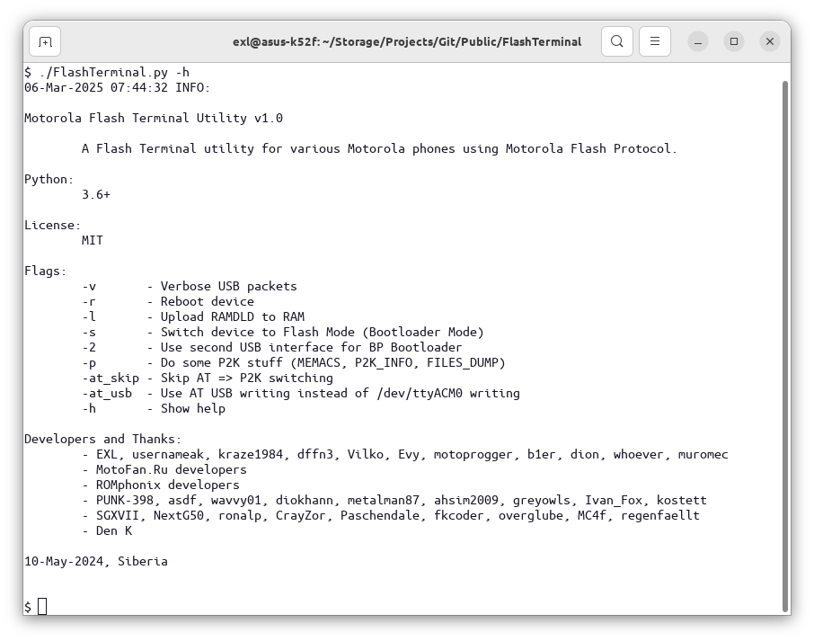

# Flash Terminal

A set of utilities and patched/hacked RAMDLD loaders (RAM downloaders) for dumping SRAM, NAND, NOR, etc. memory chips data of Motorola phones and researching the Motorola Flash Protocol.



Detailed user manual (in English): [LPCwiki](https://lpcwiki.miraheze.org/wiki/Dumping_firmware_from_phones/Motorola#FlashTerminal)

## Dependencies

* Python 3.6+

```bash
# pip install pyusb
# pip install pyserial

# Alternative non-pip Debian-like Linux distros.
$ sudo apt install python3-usb
$ sudo apt install python3-serial
```

## Usage

The workflow can be configured directly in the [FlashTerminal.py](FlashTerminal.py) file's `Settings` and `Worksheet` sections.

```bash
$ ./FlashTerminal.py -v       # Activate verbose hexdump USB-packets logging.
$ ./FlashTerminal.py -r       # Reboot device.
$ ./FlashTerminal.py -l       # Upload RAMDLD to RAM.
$ ./FlashTerminal.py -s       # Switch device to Flash Mode (Bootloader Mode).
$ ./FlashTerminal.py -2       # Use second USB interface for BP Bootloader.
$ ./FlashTerminal.py -p       # Do some P2K stuff (MEMACS, P2K_INFO, FILES_DUMP)
$ ./FlashTerminal.py -at_skip # Skip AT => P2K switching
$ ./FlashTerminal.py -at_usb  # Use AT USB writing instead of /dev/ttyACM0 writing
$ ./FlashTerminal.py -h       # Show help.
```

## Dumping Table

These phones were dumped by the Flash Terminal tool:

```
| Phone             | SoC                         | Flash           | Loader                                        | Dumped by                |
|-------------------|-----------------------------|-----------------|-----------------------------------------------|--------------------------|
| A830              | Rainbow                     | 16 MiB (NOR)    | A830_RAMDLD_0520_Patched_Dump_NOR.ldr         | EXL, greyowls            |
| U10               | Rainbow                     | 16 MiB (NOR)    | A830_RAMDLD_0520_Patched_Dump_NOR.ldr         | EXL                      |
| A835              | Rainbow POG                 | 16 MiB (NOR)    | A835_RAMDLD_0612_Hacked_RSA_Read.ldr          | PUNK-398                 |
| A845              | Rainbow POG                 | 16 MiB (NOR)    | A835_RAMDLD_0612_Hacked_RSA_Read.ldr          | PUNK-398                 |
| C975              | Rainbow POG                 | 32 MiB (NOR)    | A835_RAMDLD_0612_Hacked_RSA_Read.ldr          | diokhann, metalman87     |
| V980              | Rainbow POG                 | 32 MiB (NOR)    | A835_RAMDLD_0612_Hacked_RSA_Read.ldr          | metalman87               |
| E1000             | Rainbow POG                 | 64 MiB (NOR)    | A835_RAMDLD_0612_Hacked_RSA_Read.ldr          | PUNK-398                 |
| E398              | Neptune LTE                 | 32 MiB (NOR)    | E398_RAMLD_07B0_Hacked_Dump.ldr               | EXL                      |
| V3x               | Rainbow POG                 | 64 MiB (NOR)    | V3x_RAMDLD_0682_RSA_Read.ldr                  | EXL                      |
| A1000             | BP: Rainbow POG             | 16 MiB (NOR)    | A1000_BP_RAMDLD_0651_RSA_Read.ldr             | PUNK-398, CrayZor        |
| C350L             | Neptune ULS                 | 8 MiB (NOR)     | C350L_RAMDLD_0000_Patched_Dump_NOR.ldr        | EXL                      |
| C330              | Neptune LT (LCA)            | 8 MiB (NOR)     | E380_RAMDLD_0910_Hacked_Dump.ldr              | Ivan_Fox                 |
| C350              | Neptune LT (LCA)            | 8 MiB (NOR)     | E380_RAMDLD_0910_Hacked_Dump.ldr              | diokhann                 |
| C450              | Neptune LT (LCA)            | 16 MiB (NOR)    | E380_RAMDLD_0910_Hacked_Dump.ldr              | metalman87, ahsim2009    |
| C550              | Neptune LT (LCA)            | 16 MiB (NOR)    | E380_RAMDLD_0910_Hacked_Dump.ldr              | ahsim2009, tfa8          |
| E380              | Neptune LT (LCA)            | 16 MiB (NOR)    | E380_RAMDLD_0910_Hacked_Dump.ldr              | SGXVII, tfa8, EXL        |
| V60               | Patriot                     | 4 MiB (NOR)     | V60_RAMDLD_0355_Patched_Dump_NOR.ldr          | Ivan_Fox, NextG50        |
| V66i              | Patriot                     | 8 MiB (NOR)     | V60_RAMDLD_0355_Patched_Dump_NOR.ldr          | Ivan_Fox                 |
| V60i              | Patriot                     | 8 MiB (NOR)     | V60i_RAMDLD_1007_Patched_Dump_NOR.ldr         | metalman87, MC4f         |
| V70               | Patriot                     | 8 MiB (NOR)     | V60_RAMDLD_0355_Patched_Dump_NOR.ldr          | kostett                  |
| T720i             | Patriot                     | 8 MiB (NOR)     | T720_RAMDLD_0370_Patched_Dump_NOR.ldr         | diokhann                 |
| T722i             | Patriot                     | 8 MiB (NOR)     | T720_RAMDLD_0370_Patched_Dump_NOR.ldr         | Paschendale, MC4f        |
| V120c             | Wally                       | 4 MiB (NOR)     | V120c_RAMDLD_0312_Patched_Dump_NOR.ldr        | NextG50                  |
| ic902             | MSM6800                     | 128 MiB (NAND)  | QA30_RAMDLD_0206_Patched_Dump_NAND.ldr        | EXL                      |
| QA30              | MSM6575                     | 256 MiB (NAND)  | QA30_RAMDLD_0206_Patched_Dump_NAND_WIDE.ldr   | EXL                      |
| V9m               | MSM6550                     | 128 MiB (NAND)  | V9m_RAMDLD_01B5_Patched_Dump_NAND.ldr         | EXL, Neko-mata           |
| VE40              | MSM6800                     | 128 MiB (NAND)  | QA30_RAMDLD_0206_Patched_Dump_NAND.ldr        | EXL                      |
| Z6m               | MSM6550                     | 64 MiB (NAND)   | V9m_RAMDLD_01B5_Patched_Dump_NAND.ldr         | EXL                      |
| V3m               | MSM6500                     | 64 MiB (NAND)   | V3m_RAMDLD_010C_Patched_Dump_NAND.ldr         | asdf                     |
| W755              | MSM6500                     | 64 MiB (NAND)   | V3m_RAMDLD_010C_Patched_Dump_NAND.ldr         | asdf                     |
| E815              | MSM6500                     | 64 MiB (NAND)   | V3m_RAMDLD_010C_Patched_Dump_NAND.ldr         | asdf                     |
| W385              | MSM6125                     | 64 MiB (NAND)   | V3m_RAMDLD_010C_Patched_Dump_NAND.ldr         | asdf, wavvy01            |
| V325i             | MSM6100                     | 64 MiB (NAND)   | V325i_RAMDLD_010A_Patched_Dump_NAND.ldr       | asdf                     |
| V325xi            | MSM6100                     | 64 MiB (NAND)   | V325i_RAMDLD_010A_Patched_Dump_NAND.ldr       | asdf                     |
| K1m (K1mm)        | MSM6500                     | 64 MiB (NAND)   | K1mm_RAMDLD_000D_Patched_Dump_NAND.ldr        | wavvy01                  |
| V120e             | MSM5100                     | 4+1 MiB (NOR)   | V120e_RAMDLD_0713_Patched_Dump_NOR.ldr        | metalman87               |
| W315              | MSM6050                     | 16 MiB (NOR)    | W315_RAMDLD_0106_Patched_Dump_NOR.ldr         | asdf                     |
| A760              | AP: Dalhart                 | 32 MiB (NOR)    | A760_AP_RAMDLD_0000_Patched_Dump_NOR.ldr      | EXL, PUNK-398            |
| A760              | BP: Neptune LT (LCA)        | 4 MiB (NOR)     | A760_BP_RAMDLD_0372_Patched_Dump_NOR.ldr      | EXL, PUNK-398            |
| A768i             | AP: Dalhart                 | 32 MiB (NOR)    | A768i_AP_RAMDLD_0000_Patched_Dump_NOR.ldr     | EXL                      |
| A768i             | BP: Neptune LTE             | 4 MiB (NOR)     | A768i_BP_RAMDLD_0731_Patched_Dump_NOR.ldr     | EXL                      |
| A780DVB-H         | BP: Neptune LTE             | 4 MiB (NOR)     | A780g_BP_RAMDLD_08A0.ldr                      | ronalp                   |
| L72/L9            | Neptune LTE2 irom0400       | 64 MiB (NOR)    | L72_RAMDLD_0C70.ldr                           | fkcoder                  |
| K1s               | Neptune LTE2 irom0400       | 64 MiB (NOR)    | K1s_RAMDLD_0DC0.ldr                           | fkcoder                  |
| CC75/Mosel        | Neptune LTE                 | 32 MiB (NOR)    | P2K/TCMD/TCI MEMACS                           | overglube                |
| U3                | Neptune LTE2 irom0400       | 32 MiB (NOR)    | U3_RAMDLD_0CF0.ldr                            | fkcoder                  |
| K3                | ArgonLV                     | 32+32 MiB (NOR) | K3_RAMDLD_0320.ldr                            | fkcoder                  |
| T280              | Patriot                     | 4 MiB (NOR)     | V60i_RAMDLD_1007_Patched_Dump_NOR.ldr         | MC4f, regenfaellt        |
| T720              | Patriot                     | 8 MiB (NOR)     | T720_RAMDLD_0370_Patched_Dump_NOR.ldr         | regenfaellt, MC4f        |
| C353t             | Patriot TDMA                | 8 MiB (NOR)     | V60i_RAMDLD_1007_Patched_Dump_NOR.ldr         | MC4f                     |
| V60i(C)           | Wally                       | 4 MiB (NOR)     | V120c_RAMDLD_0312_Patched_Dump_NOR.ldr        | MC4f                     |
| V60t              | Patriot TDMA                | 4 MiB (NOR)     | V60i_RAMDLD_1007_Patched_Dump_NOR.ldr         | MC4f                     |
| CC75/Mars         | Neptune LTE                 | 32 MiB (NOR)    | Hitagi_LTE1_AMD_16.ldr                        | Den K, ahsim2009         |
| V3xx              | ArgonLV                     | 32+32 MiB (NOR) | K3_RAMDLD_0320.ldr                            | fkcoder                  |
| A910              | AP: Bulverde                | 64 MiB (NOR)    | gen-blob/blob-a1200                           | PUNK-398                 |
| A910              | BP: Neptune LTE2            | 4 MiB (NOR)     | A910i_BP_RAMDLD_0982.ldr                      | PUNK-398                 |
| M701iG            | Argon+                      | 32+32 MiB (NOR) | M702iG_RAMDLD_0303.ldr                        | WN3DL                    |
| M1000             | BP: Rainbow POG             | 16 MiB (NOR)    | A1000_BP_RAMDLD_0651_RSA_Read.ldr             | PUNK-398                 |
| M702iG            | Argon+                      | 32+32 MiB (NOR) | M702iG_RAMDLD_0303.ldr                        | PUNK-398                 |
| U15               | Rainbow POG                 | 16 MiB (NOR)    | A835_RAMDLD_0612_Hacked_RSA_Read.ldr          | ahsim2009, kostett       |
| A1600             | BP: Neptune LTE2 irom0400   | 4 MiB (NOR)     | Hitagi_LTE2_Compact_Intel_16.ldr              | Neko-mata                |
| CC75/Mars         | Neptune LTE                 | 32 MiB (NOR)    | Hitagi_LTE1_AMD_16.ldr                        | EINEX, BonfireCZ         |
| V9/Emerald2100    | ArgonLV                     | 64 MiB (NOR)    | V9_RAMDLD_R263313_05F4.ldr                    | Neko-mata                |
| M702iS            | Argon+                      | 32+32 MiB (NOR) | M702iS_RAMDLD_0303.ldr                        | LNRC (Unabandonware)     |
| V60t Color        | Patriot TDMA                | 8 MiB (NOR)     | T720_RAMDLD_0370_Patched_Dump_NOR.ldr         | vinnyboombottzz          |
| CC75/Mars         | Neptune LTE                 | 32 MiB (NOR)    | P2K/TCMD/TCI MEMACS                           | Daniel Linhart           |
| Z6c               | MSM6550                     | 128 MiB (NAND)  | Z6c_RAMDLD_000D_Patched_Dump_NAND.ldr         | PUNK-398                 |
| V66 Japanese      | Patriot                     | 4 MiB (NOR)     | V60i_RAMDLD_1007_Patched_Dump_NOR.ldr         | LNRC (Unabandonware)     |
| V3i               | Neptune LTE2                | 48 MiB (NOR)    | V3e_RAMDLD_0A40.ldr                           | EXL                      |
| A630              | Neptune LTE                 | 32 MiB (NOR)    | E398_RAMDLD_07B0_Hacked_Dump.ldr              | EXL                      |
| V710              | MSM6100                     | 32 MiB (NOR)    | V710_RAMDLD_0807_Patched_Dump_NOR.ldr         | EXL                      |
| Z10               | BP: ArgonLV                 | 32 MiB (NOR)    | No Loader, just READ with `-2` argument       | EXL                      |
| E725 London       | MSM6500                     | 64 MiB (NAND)   | V3m_RAMDLD_010C_Patched_Dump_NAND.ldr         | EXL                      |
| V1100 Rocket      | ArgonLV                     | 32+32 MiB (NOR) | K3_RAMDLD_0320.ldr                            | EXL                      |
| A768              | AP: Dalhart                 | 32 MiB (NOR)    | A760_AP_RAMDLD_0000_Patched_Dump_NOR.ldr      | EXL                      |
| A768              | BP: Neptune LT (LCA)        | 4 MiB (NOR)     | A760_BP_RAMDLD_0372_Patched_Dump_NOR.ldr      | EXL                      |
| A780              | AP: Bulverde                | 32 MiB (NOR)    | gen-blob/blob-a780                            | EXL                      |
| A780              | BP: Neptune LTE             | 4 MiB (NOR)     | A768i_BP_RAMDLD_0731_Patched_Dump_NOR.ldr     | EXL                      |
| E680g             | AP: Bulverde                | 32 MiB (NOR)    | gen-blob/blob-a780                            | EXL                      |
| E680g             | BP: Neptune LTE             | 4 MiB (NOR)     | E680i_BP_RAMDLD_08A0.ldr                      | EXL                      |
| C350LTS           | Neptune LTS                 | 8 MiB (NOR)     | C350LTS_RAMDLD_0920_Patched_Dump_NOR.ldr      | PUNK-398                 |
| V60t Color        | Patriot TDMA                | 8 MiB (NOR)     | T720_RAMDLD_0370_Patched_Dump_NOR.ldr         | xkonstantin              |
```

## Worksheet Examples

Please see [Worksheet.md](Worksheet.md) document.

## Developers & Thanks

- EXL, usernameak, kraze1984, dffn3, Vilko, Evy, motoprogger, b1er, dion, whoever, muromec
- MotoFan.Ru developers
- ROMphonix developers
- PUNK-398, asdf, wavvy01, diokhann, metalman87, ahsim2009, greyowls, Ivan_Fox, kostett
- SGXVII, NextG50, ronalp, CrayZor, Paschendale, fkcoder, overglube, MC4f, regenfaellt
- Den K, WN3DL, tfa8, EINEX, BonfireCZ, Neko-mata, LNRC (Unabandonware), vinnyboombottzz
- Daniel Linhart, xkonstantin

## Useful Information and Resources

- https://github.com/dumpit3315/dumpit by dffn3
- https://github.com/MotoFanRu/LTE-Hitagi by muromec
- https://github.com/ktdumper/ktdumper by xyzz and Keitai Wiki Discord server
- MotoFan.Ru forum about modding Motorola phones
- ROMphonix Club Discord server
